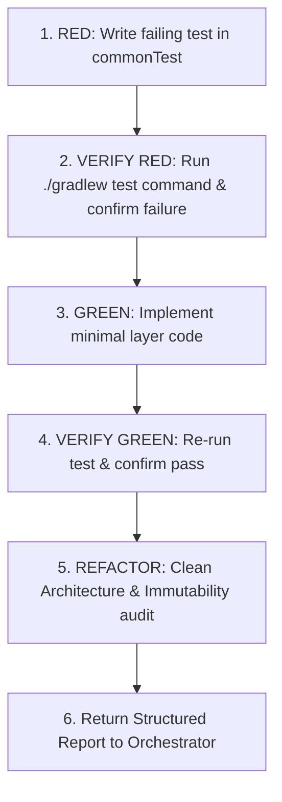

# TDD Subagent Production & Orchestration Rules

These rules govern the multi-agent delegation pattern for all feature development and bug fixes within the Sahaba Companions project.

---

## 1. Mandatory Subagent Delegation

Whenever developing a new feature, modifying existing feature logic, or fixing a bug:
1. **Never implement directly in the primary agent thread**: The primary agent must act exclusively as the **Architect & Orchestrator**.
2. **Always spawn a dedicated subagent**: The primary agent **MUST** call `invoke_subagent` to produce an isolated, task-specific agent to execute the TDD inner loop.
3. **Default Workspace Mode**: Use `Workspace: "inherit"` to ensure direct file visibility and utilize the persistent Gradle daemon and build cache. Use `Workspace: "branch"` only when the developer explicitly requests isolated branch experimentation.

---

## 2. Orchestration Contract

Before invoking the TDD subagent, the primary agent must establish the task contract in the invocation `Prompt`:

### For Feature Development
- **Feature Identifier & Scope**: e.g., `FEAT-00X`, scope boundaries, non-goals.
- **Acceptance Criteria (AC) Matrix**: Tabular list of scenarios mapping Given/When/Then to target layers.
- **Target Source Paths**: Explicit locations for Domain (`domain/model/`, `domain/repository/`, `domain/usecase/`), Data (`data/repository/`), Presentation (`presentation/...`), DI (`di/AppModule.kt`), and XML resources.
- **Test Doubles**: Path to in-memory fakes (`shared/src/commonTest/.../fakes/`) to use or extend.
- **Test Command**: `./gradlew :shared:testAndroidHostTest --tests "*<TargetTest>*"`.

### For Bug Fixing
- **Bug Description & Root Cause Hypothesis**.
- **Reproduction Test Scenario**: Exact Given/When/Then scenario reproducing the faulty behavior.
- **Expected vs. Actual Behavior**.
- **Affected Layer Boundaries**.
- **Test Command**: Fast targeted test suite execution.

---

## 3. Dedicated Subagent Execution Invariants

The spawned TDD subagent must strictly execute the 3-phase TDD cycle:

1. **RED Phase**:
   - Write test in `commonTest` adhering to pure Kotlin conventions (`kotlin.test`, `runTest`, `advanceUntilIdle()`).
   - Run `./gradlew :shared:testAndroidHostTest --tests "*YourTest*"` and confirm it fails for the expected reason.
2. **GREEN Phase**:
   - Implement the minimum code needed to pass the test, strictly respecting Clean Architecture order (Domain -> Data -> Presentation -> DI -> Strings).
   - Re-run test to verify it passes.
3. **REFACTOR Phase**:
   - Clean up code and eliminate duplication.
   - Run architectural guardrail checks (pure Kotlin domain, `@Immutable` UI models, XML strings in `values/strings.xml` and `values-ar/strings.xml`, no mocked libraries).
   - Run `./gradlew :shared:testAndroidHostTest` to ensure no regressions across the test suite.

---

## 4. Zero-Approval Autonomous Execution Mandate

Subagents spawned for TDD or SDD tasks must operate with complete autonomy:
- **Never Prompt for Intermediate Approval**: The subagent must never pause execution to ask the developer or orchestrator for approval, permission, or feedback between phases (RED, GREEN, REFACTOR), before file creation, or after authoring specs.
- **No Interactive Tools**: The subagent must not invoke interactive questioning tools (e.g. `ask_question`) to seek permission.
- **Self-Healing Iteration**: When encountering compilation errors or failing test assertions, the subagent must inspect Gradle output, iterate on the code, and re-run tests self-sufficiently without human intervention.
- **Single Completion Delivery**: The subagent communicates back to the parent orchestrator via `send_message` only upon completing the task with all tests passing.

---

## 5. Handoff & Orchestrator Verification

Upon receiving the subagent's completion report:
1. The primary agent reviews the modified files and test verification outputs.
2. The primary agent executes the `arch-audit` skill to ensure no layer boundary violations were introduced.
3. The primary agent presents the walkthrough to the developer.
