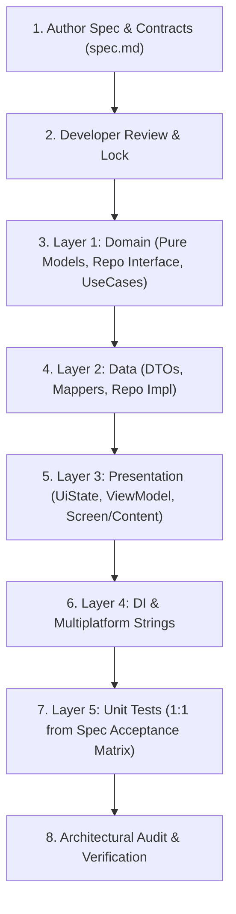

# Spec-Driven Development (SDD) Guide & Workflow

Use this skill whenever a feature or change is implemented following Spec-Driven Development.

---

## 1. The Core SDD Protocol

SDD ensures zero AI hallucination by establishing an unbreachable workflow:



---

## 2. Step-by-Step Execution

### Step 1: Draft Spec & Contracts
Create `docs/specs/SPEC-<NUMBER>-<feature-name>/spec.md` using the template at `docs/specs/templates/SPEC_TEMPLATE.md`.
Ensure the following sections are strictly defined:
1. **Scope & Non-Goals**: Explicitly list what the feature WILL NOT do.
2. **Domain Models**: Immutable data classes (`domain/model/`).
3. **Repository Interface**: Pure Kotlin suspend/flow methods returning `Result<T>` (`domain/repository/`).
4. **Use Case Signatures**: Single-operation `operator fun invoke()` classes (`domain/usecase/`).
5. **Presentation Contract**: `@Immutable sealed interface UiState`, `sealed interface UiAction`, `sealed interface UiEffect`.
6. **Acceptance Criteria Matrix**: Tabular scenarios mapping Given/When/Then to target layers.
7. **Multiplatform Strings**: English & Arabic keys.

### Step 2: User Approval (Spec Freeze)
Present the spec to the developer. Once approved:
- The specification is **frozen**.
- Do not introduce unplanned dependencies, models, or layer crossings.

### Step 3: Layered Implementation
Implement in strict order:
1. **Domain**:
   - `shared/src/commonMain/kotlin/com/aslmmovic/qurancompanion/domain/model/`
   - `shared/src/commonMain/kotlin/com/aslmmovic/qurancompanion/domain/repository/`
   - `shared/src/commonMain/kotlin/com/aslmmovic/qurancompanion/domain/usecase/`
2. **Data**:
   - `shared/src/commonMain/kotlin/com/aslmmovic/qurancompanion/data/dto/` (if network/disk format differs)
   - `shared/src/commonMain/kotlin/com/aslmmovic/qurancompanion/data/mapper/` (`toDomain()`)
   - `shared/src/commonMain/kotlin/com/aslmmovic/qurancompanion/data/repository/`
3. **Presentation**:
   - `shared/src/commonMain/kotlin/com/aslmmovic/qurancompanion/presentation/<feature>/`
   - ViewModel: Extends `ViewModel()`, exposes `val uiState: StateFlow<UiState>`, `val uiEffect: Flow<UiEffect>`, and action methods like `fun onAction(action: UiAction)` or explicit functions.
   - Screen Container: Reads ViewModel, hoists state, handles navigation.
   - Content: Stateless composable accepting `UiState` and `(UiAction) -> Unit`.
4. **DI & Localization**:
   - Register bindings in `shared/src/commonMain/kotlin/com/aslmmovic/qurancompanion/di/AppModule.kt`.
   - Add entries to `shared/src/commonMain/composeResources/values/strings.xml` and `values-ar/strings.xml`.

### Step 4: Verification & Acceptance Tests
1. Generate test suites under `shared/src/commonTest/kotlin/...` using pure Kotlin test fakes (no mock frameworks).
2. Ensure every row in the spec's **Acceptance Criteria Matrix** has at least one corresponding unit test.
3. Run the tests:
   ```bash
   ./gradlew :shared:allTests
   ```
4. Run architectural audit:
   - Check with `arch-audit` skill to verify zero layer breaches or platform leaks.
