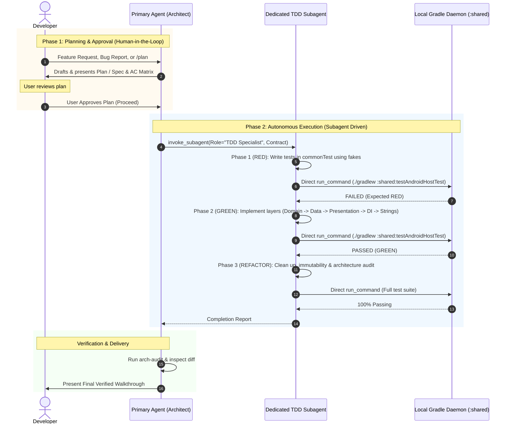

# Unified TDD & SDD Workflow Guide & Orchestration Skill

This is the **single authoritative source of truth** for all feature development, architectural changes, and bug fixes in the Sahaba Companions project. It unifies contract-first Spec-Driven Development (SDD) with the fast Test-Driven Development (TDD) inner loop into a strict two-phase workflow.

---

## 1. Two-Phase Workflow Overview



---

## 2. Phase 1: Planning & Contract Formulation (User Approval Mandatory)

The Primary Agent acts as **Architect & Orchestrator**:

1. **Research & Formulate Plan**:
   - Establish scope boundaries, non-goals, and architectural impact.
   - Author Acceptance Criteria (AC) Matrix mapping Given/When/Then scenarios to target Clean Architecture layers.
   - For complete features, follow the template in `docs/specs/templates/SPEC_TEMPLATE.md` to draft `docs/specs/SPEC-<NUMBER>-<feature-name>/spec.md` or create a `/plan` artifact.
2. **Present Plan to Developer**:
   - Create an implementation plan artifact with `RequestFeedback: true` and `UserFacing: true`.
   - **STRICT PROHIBITION ON AUTO-APPROVAL**: The AI must **never** auto-approve plans, specifications, or architectural choices. The AI must wait for the user to explicitly review and accept the plan.
3. **Wait for Developer Approval**:
   - Only after the user confirms approval (e.g., clicking proceed or sending approval message) does the Orchestrator lock the contract and invoke the subagent.

---

## 3. Phase 2: Autonomous Subagent Execution (Post-Approval)

Under project rules, **all feature development and bug fixes must produce a dedicated subagent** specifically tasked with executing the TDD inner loop in an isolated context (`Workspace: "inherit"`).

### Autonomous Execution Mandate (Zero Mid-Flight Interruption)
- **Direct Tool & Command Execution**: The subagent must run all necessary terminal commands directly via `run_command` without asking the user or orchestrator for conversational permission (e.g. never ask *"May I run ./gradlew?"*).
- **No Intermediate Halts**: The subagent must not pause between TDD phases (RED, GREEN, REFACTOR) to seek user confirmation or review.
- **No Interactive Interruption Tools**: Do not invoke `ask_question` or set `RequestFeedback: true` during active subagent execution.
- **Self-Healing Iteration**: On compiler errors or test failures, inspect the Gradle stack trace, iterate on the code, and re-run tests self-sufficiently.
- **Single Final Delivery**: Communicate back via `send_message` only upon completing the entire task with 100% passing tests.

---

## 4. The Inner Loop Command Matrix

| Target | Command | Time | When to Use |
| :--- | :--- | :--- | :--- |
| **Fast Local TDD Loop** | `./gradlew :shared:testAndroidHostTest` | ~3–10s | Active Red-Green-Refactor iteration on any common or Android logic. |
| **Focused Test Class** | `./gradlew :shared:testAndroidHostTest --tests "*<TargetTest>*"` | ~2s | Focused testing on a specific feature suite. |
| **Continuous Watch Mode** | `./gradlew :shared:testAndroidHostTest --continuous` | Instant | Daemon stays alive, automatically re-running tests on file changes. |
| **Full Multiplatform Suite**| `./gradlew :shared:allTests` | ~90s | Final pre-push / CI verification across all targets. |

---

## 5. Strict Clean Architecture Layer Order

When implementing in the GREEN phase, code must be written strictly layer-by-layer:

1. **Domain Layer** (Pure Kotlin, zero platform imports):
   - Models: `shared/src/commonMain/kotlin/.../domain/model/`
   - Repository Interfaces: `shared/src/commonMain/kotlin/.../domain/repository/` (returning `Result<T>` or `Flow<T>`)
   - Use Cases: `shared/src/commonMain/kotlin/.../domain/usecase/` (single-purpose `operator fun invoke()`)
2. **Data Layer**:
   - DTOs: `shared/src/commonMain/kotlin/.../data/dto/` (if network/disk differs)
   - Mappers: `shared/src/commonMain/kotlin/.../data/mapper/` (`toDomain()` extension functions)
   - Repository Implementations: `shared/src/commonMain/kotlin/.../data/repository/`
3. **Presentation Layer**:
   - State & Events: `@Immutable sealed interface UiState`, `sealed interface UiAction`, `sealed interface UiEffect`
   - ViewModel: Extends `ViewModel()`, injects Use Cases (never Repositories), exposes `StateFlow<UiState>`
   - Screen Container: Reads ViewModel, hoists state, handles navigation
   - Stateless Content: Accepts `UiState` and `(UiAction) -> Unit`
4. **DI & Localization**:
   - Koin bindings: `shared/src/commonMain/kotlin/.../di/AppModule.kt`
   - Strings: Multiplatform XMLs in `values/strings.xml` (English) and `values-ar/strings.xml` (Arabic)

---

## 6. Test Fakes Conventions (No Mocking Libraries)

All unit tests live in `shared/src/commonTest/` using pure Kotlin `kotlin.test`:
- **Location**: `shared/src/commonTest/kotlin/com/aslmmovic/qurancompanion/fakes/`
- **Zero Mock Libraries**: Never import MockK, Mockito, or PowerMock.
- **In-Memory Fakes**: Maintain lightweight in-memory fake classes implementing repository/service interfaces (e.g. `FakeJourneyRepository`, `FakeUserPreferencesRepository`).
- **Coroutine Synchronization**: Bind `StandardTestDispatcher()` and pass `testScheduler` to avoid scheduler mismatch exceptions. Call `advanceUntilIdle()` before assertions.

---

## 7. Subagent Invocation & Prompt Blueprints

### Invocation Configuration
```json
{
  "Subagents": [
    {
      "TypeName": "self",
      "Role": "TDD Feature Developer", // or "TDD Bugfix Specialist"
      "Workspace": "inherit",
      "Model": "inherit",
      "Prompt": "<Subagent Contract Prompt>"
    }
  ]
}
```

### Blueprint A: Feature Development TDD Contract Prompt
```text
You are a dedicated TDD Feature Developer for the Sahaba Companions project.
Your mission is to implement feature [FEATURE_ID: FEATURE_NAME] following strict Test-Driven Development and Clean Architecture.

### 1. Scope & Acceptance Criteria (AC) Matrix
[Insert AC Matrix here]
| ID | Given | When | Then | Target Layer |
| AC01 | ... | ... | ... | domain/usecase/ |
| AC02 | ... | ... | ... | presentation/.../ |

### 2. File Boundaries & Layers
- Domain: shared/src/commonMain/kotlin/.../domain/...
- Data: shared/src/commonMain/kotlin/.../data/...
- Presentation: shared/src/commonMain/kotlin/.../presentation/...
- DI: shared/src/commonMain/kotlin/.../di/AppModule.kt
- Strings: shared/src/commonMain/composeResources/values/strings.xml & values-ar/strings.xml
- Tests & Fakes: shared/src/commonTest/kotlin/.../

### 3. Execution Protocol (MANDATORY ORDER)
1. RED: Write failing acceptance test(s) in commonTest corresponding 1:1 with the AC Matrix.
   - Use in-memory fakes from fakes/. NEVER import MockK or Mockito.
   - Run fast test command directly via run_command: ./gradlew :shared:testAndroidHostTest --tests "*<YourTestClass>*"
   - Confirm test fails for the expected reason (RED verified).
2. GREEN: Implement minimal production code layer-by-layer:
   - Domain -> Data -> Presentation -> DI -> Strings
   - Run test command directly and confirm test passes (GREEN verified).
3. REFACTOR:
   - Clean up code, eliminate duplication, verify @Immutable on UI states, main-safe I/O.
   - Run full test suite directly: ./gradlew :shared:testAndroidHostTest

### 4. Autonomous Execution Mandate (Zero Mid-Flight Interruption)
- Directly execute all build/test commands via run_command without asking for conversational permission.
- Execute 100% autonomously from start to finish without pausing to ask the developer or orchestrator for intermediate approval.
- If tests or builds fail, inspect the stack trace, self-correct, and re-run without human intervention.
- Do NOT invoke interactive question tools (ask_question) or feedback requests.

### 5. Output Report
When complete, return a concise report with:
- List of created/modified files
- Test command output confirming PASS
- Any architectural notes or fakes added
```

### Blueprint B: Bugfix TDD Contract Prompt
```text
You are a dedicated TDD Bugfix Specialist for the Sahaba Companions project.
Your mission is to resolve bug [BUG_DESCRIPTION] using strict Test-Driven Development.

### 1. Bug Reproduction & Expected Behavior
- Observed Flaw: [Description of bug]
- Root Cause Hypothesis: [Hypothesis]
- Expected Behavior: [What should happen]

### 2. Execution Protocol (MANDATORY ORDER)
1. RED: Write a regression test in commonTest reproducing the bug.
   - Run directly: ./gradlew :shared:testAndroidHostTest --tests "*<RegressionTest>*"
   - Confirm the test FAILS, reproducing the bug (RED verified).
2. GREEN: Implement minimal surgical fix in the affected layer.
   - Run directly: ./gradlew :shared:testAndroidHostTest --tests "*<RegressionTest>*"
   - Confirm the test PASSES (GREEN verified).
3. REFACTOR:
   - Clean up without expanding scope.
   - Run full test suite directly: ./gradlew :shared:testAndroidHostTest to verify zero regressions.

### 3. Autonomous Execution Mandate (Zero Mid-Flight Interruption)
- Directly execute all build/test commands via run_command without asking for conversational permission.
- Execute autonomously end-to-end without pausing for intermediate approval.
- Self-correct errors and deliver the completion report upon successful verification.

### 4. Output Report
When complete, return a concise report with:
- Files modified
- Before/After behavior summary
- Test run confirmation
```

---

## 8. Orchestrator Post-Execution Verification

Upon receiving the subagent's completion report:
1. Review the git diff and list of touched files.
2. Run the `arch-audit` skill to ensure architectural rules were upheld:
   - Zero platform imports in `domain/`
   - ViewModels inject Use Cases, not raw Repositories
   - UI states annotated with `@Immutable`
   - Strings present in both EN and AR XMLs
3. Present the walkthrough artifact to the developer.
