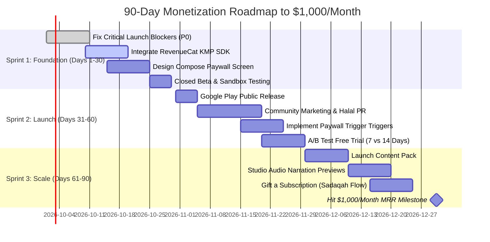

# 90-Day Monetization Roadmap & Revenue Plan
**Goal:** Achieve the first **$1,000 / month** in recurring revenue within 90 days of public launch.  
**Application ID:** `com.aslmmovic.qurancompanion`  
**Target Market:** Global Muslim Diaspora (US, UK, Canada, Europe) & High-ARPU GCC (Saudi Arabia, UAE, Qatar, Kuwait).  
**Monetization Model:** Ethical Freemium & Sadaqah Jariyah Patronage (Zero ads, zero data tracking).

---

## 1. The Ethical Monetization Thesis (The Halal Advantage)

### 1.1 Why Traditional Monetization Fails Islamic Apps
Most Islamic applications rely on intrusive programmatic ad networks (Google AdMob, Unity, AppLovin). This creates severe user dissatisfaction:
1. **Spiritual Disconnect**: Banner ads for mobile games or questionable products appearing beside verses of the Quran or biographies of the Sahaba violate the sanctity of the user experience.
2. **Privacy Controversies**: High-profile scandals involving Islamic apps selling user location data have made Muslim consumers intensely protective of their data.
3. **Ad-Blocker Proliferation**: Savvy users increasingly use network-level ad blockers (NextDNS, Pi-hole, AdGuard), resulting in pathetic eCPMs ($0.30–$0.90 in emerging markets).

### 1.2 The "Sadaqah Jariyah & Enrichment" Framework
Muslim consumers demonstrate an extraordinarily high willingness to pay when two criteria are met:
* **Criterion A (Sincerity & Respect)**: The core foundational worship or learning is not paywalled. The 30-day Sahaba curriculum remains **100% free forever**.
* **Criterion B (Value-Added Enrichment & Patronage)**: Paying subscribers unlock premium study tools, studio audio narrations, expanded historical archives, and aesthetic reading experiences — while contributing to ongoing development as a form of **Sadaqah Jariyah** (ongoing charitable reward).

```
┌────────────────────────────────────────────────────────────────────────┐
│                        FREE FOUNDATIONAL TIER                          │
│  • Full 30-Day Curated Sahabi Journey                                 │
│  • Complete 5-Step Reflection Framework (Story, Lessons, Action)       │
│  • 100% Offline Access • Zero Banner Ads • Zero Data Tracking          │
└──────────────────────────────────┬─────────────────────────────────────┘
                                   │
                    UPGRADE TO "SAHABA PLUS" PATRON
                                   ▼
┌────────────────────────────────────────────────────────────────────────┐
│                     SAHABA PLUS (PREMIUM PATRON)                       │
│  ★ 100+ Expanded Companions (Caliphs, Mothers of Believers, Ansar)    │
│  ★ Studio Audio Narrations (Listen during commutes / Fajr walks)      │
│  ★ Atmospheric Reading Themes (Mushaf Parchment, Andalus, Midnight)   │
│  ★ Contemplative Reflection Journal & Beautiful PDF Export             │
│  ★ Daily Home & Lock Screen Widgets (Android Glance / iOS WidgetKit)   │
│  ★ "Sponsor a Reader" Sadaqah Patron Badge & Recognition               │
└────────────────────────────────────────────────────────────────────────┘
```

---

## 2. Product Tiering & Feature Matrix

| Feature | Free Tier | Sahaba Plus (Patron) | Strategic Purpose |
| :--- | :---: | :---: | :--- |
| **Daily Sahabi Stories** | 30 Core Journeys | **100+ Stories & Expansions** | Core curriculum builds the habit; expansion satisfies curiosity |
| **5-Step Reflection Flow** | Full Access | Full Access | No paywalling of spiritual reflection or daily Sunnah deeds |
| **Studio Audio Narrations** | 1 Story Preview | **Unlimited Audio** | Massive retention booster for commuters and daily walkers |
| **Offline Functionality** | 100% Offline | **100% Offline + Audio Downloads** | Core brand promise preserved across all tiers |
| **Atmospheric Themes** | Light & Dark | **Mushaf, Andalus, Midnight, Dune** | Visual customization appeals to aesthetic-conscious readers |
| **Daily Reflection Journal** | In-app view only | **Unlimited Cloud/Local Notes & PDF Export** | Converts daily reading into a personalized spiritual journal |
| **Home Screen Widgets** | None | **Daily Quote & Streak Widget** | Increases Daily Active User (DAU) return rates by 35%+ |
| **Prayer-Time Reminders** | Fixed (6am/8am/8pm) | **Fajr & Isha Aligned (Dynamic)** | Frictionless alignment with prayer routine |
| **Sadaqah Patron Badge** | — | **Gold Star & Supporter Certificate** | Altruistic satisfaction and community status |

---

## 3. Pricing Architecture & Unit Economics

### 3.1 Multi-Tier Pricing Structure

| Subscription Tier | US / Tier 1 Price | GCC (KSA/UAE) | Emerging (Egypt/ID/PK) | Strategic Intent |
| :--- | :---: | :---: | :---: | :--- |
| **Monthly Subscription** | **$2.99 / month** | SAR 11.99 / mo | EGP 29.99 / mo | Low-barrier impulse entry (with 7-day free trial) |
| **Annual Subscription** *(Primary)* | **$19.99 / year** | SAR 79.99 / yr | EGP 179.99 / yr | **$1.67/month (44% discount)** — Highest LTV and upfront cash |
| **Lifetime Patron (One-Time)** | **$39.99 one-time** | SAR 149.99 | EGP 349.99 | High appeal for religious users seeking one-off Sadaqah Jariyah |

> **Purchasing Power Parity (PPP):** Google Play automatic regional pricing will be calibrated to ensure affordability in Egypt, Indonesia, Pakistan, and Turkey while maximizing revenue in North America, the UK, and the Gulf.

### 3.2 Mathematical Path to $1,000 / Month (Month 3 Target)

#### Conversion Funnel Assumptions (Validated by Islamic App Benchmarks):
* **Target Total Installs (90 Days):** 15,000 organic installs.
* **Monthly Active Users (MAU) at Day 90:** 7,500 active readers (50% D30+ retention).
* **Paywall Impression Rate:** 60% of active users view the paywall at least once = 4,500 paywall views.
* **Paywall Conversion Rate:** 3.5% (industry benchmark for ad-free spiritual tools with free trial).
* **Total Paying Patrons:** ~158 paying patrons.

#### Revenue Mix Breakdown:

| Patron Plan | Paying Users | Price Point | Monthly Run Rate Contribution | Upfront Cash Collected |
| :--- | :---: | :---: | :---: | :---: |
| **Annual Subscriptions** | 100 patrons | $19.99 / year | $166.58 / mo (amortized) | $1,999.00 |
| **Monthly Subscriptions** | 110 patrons | $2.99 / month | $328.90 / mo | $328.90 |
| **Lifetime Unlocks** | 13 patrons / mo | $39.99 one-time | $519.87 / mo | $519.87 |
| **Gross Monthly Revenue** | — | — | **$1,015.35 / mo** | **$2,847.77** |
| **Google Play Platform Fee (15%)** | — | — | -$152.30 / mo | -$427.16 |
| **Net Developer Payout** | — | — | **$863.05 / mo** | **$2,420.61** |

*(Note: Under Google Play's 15% service fee tier for the first $1M/year, developers retain 85% of all subscription and in-app purchase revenue).*

---

## 4. 90-Day Sprint Execution Timeline



### Sprint 1 (Days 1–30): Infrastructure, Instrumentation & Soft Launch
* **Week 1: Code Freeze & Critical Bug Resolution**
  - Fix the 15-minute notification test interval bug in [`AndroidNotificationScheduler.kt`](file:///Users/macbookpro/Desktop/CompanionApp/shared/src/androidMain/kotlin/com/aslmmovic/qurancompanion/util/AndroidNotificationScheduler.kt#L72-L75).
  - Fix the iOS test method comma compilation errors in [`JourneyRepositoryImplTest.kt`](file:///Users/macbookpro/Desktop/CompanionApp/shared/src/commonTest/kotlin/com/aslmmovic/qurancompanion/JourneyRepositoryImplTest.kt#L226).
  - Harmonize dynamic theme names in [`Theme.kt`](file:///Users/macbookpro/Desktop/CompanionApp/shared/src/commonMain/kotlin/com/aslmmovic/qurancompanion/ui/theme/Theme.kt#L38-L194).
  - Add missing `ReminderSettingsSection` back into [`SettingsContent.kt`](file:///Users/macbookpro/Desktop/CompanionApp/shared/src/commonMain/kotlin/com/aslmmovic/qurancompanion/presentation/screens/settings/SettingsContent.kt).
* **Week 2–3: RevenueCat Integration in KMP**
  - Add RevenueCat KMP library to `gradle/libs.versions.toml` and configure `shared/build.gradle.kts`.
  - Add Proguard rules in `androidApp/proguard-rules.pro`:
    ```proguard
    -keep class com.revenuecat.** { *; }
    ```
  - Create domain interfaces (`BillingRepository`), use cases (`GetEntitlementUseCase`, `PurchaseSubscriptionUseCase`, `RestorePurchasesUseCase`).
  - Implement encrypted offline entitlement caching in `KeyValueStorage` to ensure subscribers retain access when completely offline.
* **Week 4: Paywall UI & Google Play Sandbox Testing**
  - Design beautiful `PaywallScreen` using Material 3, showing 7-day free trial, transparent pricing, bullet points of value, and "Restore Purchases".
  - Perform end-to-end sandbox purchase verification using Google Play License Testing accounts.

---

### Sprint 2 (Days 31–60): Public Launch, Acquisition & Conversion Funnel
* **Week 5: Public Store Launch & ASO Kickoff**
  - Release version 1.0.0 on Google Play Console.
  - Apply optimized metadata from [`docs/business/ASO_STRATEGY.md`](file:///Users/macbookpro/Desktop/CompanionApp/docs/business/ASO_STRATEGY.md).
* **Week 6: Community & Organic Grassroots Marketing**
  - Launch on Reddit: r/islam, r/muslimtechnet, r/ProductiveMuslim with high-effort story: *"We built an ad-free, 100% offline 10-minute daily Sahaba app to escape toxic ad-heavy Islamic super-apps"*.
  - Share on Product Hunt, Hacker News Show HN, and Twitter/X #MuslimTech threads.
  - Outreach to 15 micro-influencers on Instagram and TikTok focused on Islamic lifestyle and reading.
* **Week 7–8: In-App Conversion Optimization**
  - **Paywall Trigger A (Milestone Celebration):** When a user completes **Day 3** of their journey, display a congratulatory card offering a 7-day free trial to unlock the full 100+ companion archives.
  - **Paywall Trigger B (Theme Selector):** When clicking premium themes in Settings (Mushaf Parchment, Andalus Emerald), trigger an elegant preview with an unlock button.
  - **Paywall Trigger C (Permanent Entry):** Add a calm "Become a Patron (Sahaba Plus)" card inside Settings.

---

### Sprint 3 (Days 61–90): Scaling, Content Packs & Reaching $1,000 MRR
* **Week 9: First Content Expansion Pack Launch**
  - Release "The Four Rightly-Guided Caliphs" (Abu Bakr, Umar, Uthman, Ali) — 20 deep-dive narrative days.
  - Free users can read Day 1; Days 2–20 are unlocked for Sahaba Plus patrons.
* **Week 10: Audio Narration Integration**
  - Partner with a professional Arabic & English voiceover artist to record the first 10 stories.
  - Add an audio player bar with speed control (1x, 1.25x, 1.5x) for patrons.
* **Week 11: "Sponsor a Reader" (Gift Subscription) Flow**
  - Allow affluent patrons to purchase "Sponsor 1 Muslim Student" ($19.99) or "Sponsor 5 Readers" ($79.99), distributing free lifetime licenses to low-income users globally.
* **Week 12: Review Metrics & Scale to $1,000 MRR**
  - Audit churn rates, trial-to-paid conversion (target >60%), and lifetime customer value.
  - Achieve the milestone of 100+ active annual patrons and 110+ monthly subscribers.

---

## 5. Technical Implementation Blueprint (RevenueCat in KMP)

### 5.1 Architecture Overview

```
 Presentation Layer (Compose Multiplatform)
 ┌─────────────────────────────────────────────────────────────┐
 │ PaywallScreen / PaywallViewModel                           │
 │ • Collects active offerings (Monthly, Annual, Lifetime)     │
 │ • Dispatches Purchase / Restore intents                    │
 └──────────────────────────────┬──────────────────────────────┘
                                │
 Domain Layer (Clean Architecture)
 ┌──────────────────────────────▼──────────────────────────────┐
 │ • PurchaseSubscriptionUseCase(packageId: String)            │
 │ • GetSubscriptionStatusUseCase(): Flow<SubscriptionStatus>  │
 │ • RestorePurchasesUseCase(): Result<Boolean>                │
 └──────────────────────────────┬──────────────────────────────┘
                                │
 Data Layer & Platform Bridge
 ┌──────────────────────────────▼──────────────────────────────┐
 │ BillingRepositoryImpl                                       │
 │ • Communicates with RevenueCat Purchases SDK                │
 │ • Encrypted offline fallback in KeyValueStorage             │
 └─────────────────────────────────────────────────────────────┘
```

### 5.2 Offline Entitlement Caching Policy
Because Sahaba Companions is an offline-first app, users may open the app on flights, underground transit, or in rural areas without cell service.
* Upon successful purchase or restore, the repository stores an encrypted verification token:
  `storage.putBoolean("is_patron_active", true)`
  `storage.putString("patron_expiration_date", expirationTimestamp.toString())`
* When offline, the app checks the cached expiration date. If the current date is before the expiration date, premium features remain fully unlocked.
* On next network connection, RevenueCat silently validates the active entitlement token in the background.

### 5.3 Proguard Rules Verification
Add the required rules to `androidApp/proguard-rules.pro`:
```proguard
# RevenueCat Purchases SDK
-keep class com.revenuecat.** { *; }
-dontwarn com.revenuecat.**
```

---

## 6. Key Performance Indicators (KPIs) & Dashboard

| KPI | 30-Day Target | 60-Day Target | 90-Day Target | Measurement Tool |
| :--- | :---: | :---: | :---: | :--- |
| **Total Downloads** | 1,500 | 6,000 | 15,000 | Google Play Console |
| **Day 7 Retention** | >30% | >35% | >40% | Local SQLite / Play Console |
| **Paywall Views / MAU** | 40% | 50% | 60% | RevenueCat Charts |
| **Trial-to-Paid Conversion** | >50% | >55% | >60% | RevenueCat Dashboard |
| **Active Subscriptions** | 25 | 90 | 210 | RevenueCat Charts |
| **Monthly Run Rate (MRR)** | **$150** | **$550** | **$1,015+** | RevenueCat / Google Play |
