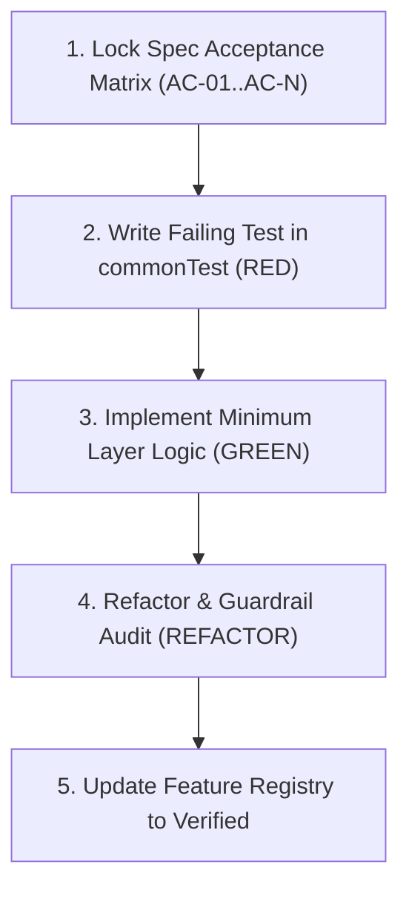
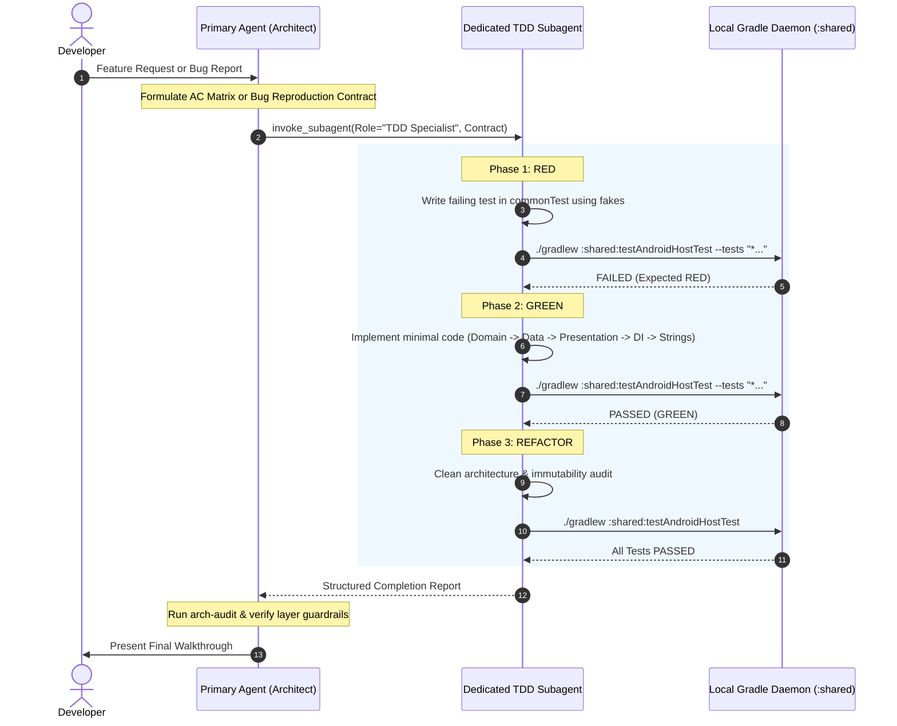

# Test-Driven & Spec-Driven Development (TDD/SDD) Workflow

This document outlines the standard TDD inner loop and Spec-Driven Development workflow for the Sahaba Companions project.

---

## 1. The Core Philosophy
1. **Spec is the Contract**: No business logic, use case, or UI state is implemented without an approved specification (`spec.md`) and Acceptance Criteria Matrix.
2. **Tests Before Code (RED)**: Write unit tests against test fakes using the exact Acceptance Criteria scenarios before implementing the production logic.
3. **Pure Kotlin Fakes**: Never import mock frameworks (MockK, Mockito). Always maintain clean, deterministic in-memory fakes in `commonTest/.../fakes/`.
4. **Fast Local Inner Loop**: Run tests locally with sub-3s JVM execution.
5. **Dedicated Subagent Production**: For all feature development and bug fixes, the primary agent acts as an orchestrator and produces a dedicated subagent specifically tasked with executing the TDD inner loop. See [TDD Subagent Production Rules](file:///.agents/rules/tdd_agent.md).

---

## 2. The Inner Loop Command Matrix

| Target | Command | Time | When to Use |
| :--- | :--- | :--- | :--- |
| **Fast Local TDD Loop** | `./gradlew :shared:testAndroidHostTest` | ~3–10s | During active Red-Green-Refactor iteration on any common or Android logic. |
| **Continuous Watch Mode** | `./gradlew :shared:testAndroidHostTest --continuous` | Instant | Keeps Gradle daemon alive and automatically re-runs tests on file changes. |
| **Single Test Class** | `./gradlew :shared:testAndroidHostTest --tests "*ViewModelsTest*"` | ~2s | Focused testing on a specific feature suite. |
| **Full Multiplatform Suite** | `./gradlew :shared:allTests` | ~90s | Pre-push / CI verification (requires Xcode command-line tools for iOS simulator binary linking). |

---

## 3. Step-by-Step TDD / SDD Cycle



### Step 1: Author Acceptance Test (RED)
Name test functions explicitly after the Acceptance Criteria identifier:

```kotlin
@Test
fun `AC01 - given cached data, when home loads, then journey state is ready`() = runTest {
    // 1. Arrange (Given)
    val testJourney = testJourney(id = "day-1")
    fakeJourneyRepo.todayJourney = testJourney

    // 2. Act (When)
    val viewModel = createHomeViewModel()
    advanceUntilIdle()

    // 3. Assert (Then)
    assertEquals(testJourney, viewModel.uiState.value.journey)
}
```

### Step 2: Run Fast Inner Loop
```bash
./gradlew :shared:testAndroidHostTest --tests "*YourNewTest*"
```
Confirm the test fails for the expected reason (RED).

### Step 3: Implement Minimum Code (GREEN)
Implement the code strictly in Clean Architecture order:
1. `domain/`: Pure models, repository interfaces, use cases.
2. `data/`: DTOs, mappers (`toDomain()`), repository implementations using `storage` or `dataSource`.
3. `presentation/`: `@Immutable` `UiState`, `UiEffect`, `ViewModel`, `Screen`, and stateless `Content`.
4. `di/`: Bindings in `AppModule.kt`.
5. `resources/`: Localization strings in `values/strings.xml` and `values-ar/strings.xml`.

Re-run the test:
```bash
./gradlew :shared:testAndroidHostTest
```
Confirm all tests pass (GREEN).

### Step 4: Refactor & Clean Architecture Audit
Run architectural verification to ensure:
- Zero platform imports in `domain/`.
- No ViewModels bypassing Use Cases to call Repositories directly.
- All domain models or UiState passed into stateless composables are `@Immutable`.
- No raw exceptions propagate to the UI.

---

## 4. Test Fakes Conventions
All test fakes live in:
`shared/src/commonTest/kotlin/com/aslmmovic/qurancompanion/fakes/`

- **FakeJourneyRepository**: In-memory repository with mutable properties (`allJourneys`, `todayJourney`, `tomorrowJourney`) and `StateFlow` streams.
- **FakeUserPreferencesRepository**: In-memory preference persistence with `MutableStateFlow<UserPreferences>`.
- **FakeNotificationScheduler**: Records scheduled hours, titles, and cancellation flags.
- **TestFixtures**: Factory methods like `testJourney(...)` with sensible defaults.

---

## 5. Multi-Agent TDD Orchestration

For all feature development and bug fixing tasks, the project follows a two-tier multi-agent orchestration architecture:



### Delegation Rules
1. **Primary Agent**: Strictly coordinates scope, contracts, and architecture. Never writes production or test code directly in the primary conversation thread for features or bugfixes.
2. **Dedicated TDD Subagent**: Produced via `invoke_subagent` using the prompt contracts defined in [TDD Subagent Orchestration Skill](file:///.agents/skills/tdd-agent/SKILL.md) and governed by [TDD Subagent Production Rules](file:///.agents/rules/tdd_agent.md).

