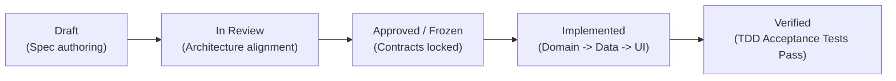

# Feature Registry (Single Source of Truth)

This registry is the authoritative inventory of all functional capabilities within the Quran Companion application. Every feature must have a corresponding specification, domain contracts, and acceptance criteria tests.

---

## Feature Status Lifecycle

---

## Active & Core MVP Features

| Feature ID | Feature Name | Spec Document | Domain Model & Contracts | Presentation & ViewModels | Test Suites | Status |
| :--- | :--- | :--- | :--- | :--- | :--- | :--- |
| **FEAT-001** | Daily Journey Engine & Caching | [`docs/project.md`](../project.md) / [`docs/mvp.md`](../mvp.md) | [`Journey`](../../shared/src/commonMain/kotlin/com/aslmmovic/qurancompanion/domain/model/Journey.kt), [`JourneyRepository`](../../shared/src/commonMain/kotlin/com/aslmmovic/qurancompanion/domain/repository/JourneyRepository.kt) | — | [`JourneyRepositoryImplTest`](../../shared/src/commonTest/kotlin/com/aslmmovic/qurancompanion/JourneyRepositoryImplTest.kt), [`SharedCommonTest`](../../shared/src/commonTest/kotlin/com/aslmmovic/qurancompanion/SharedCommonTest.kt) | `Verified` |
| **FEAT-002** | Daily Companion Reminder Notifications | [`SPEC-001`](../specs/SPEC-001-daily-notification/spec.md) | [`UserPreferences`](../../shared/src/commonMain/kotlin/com/aslmmovic/qurancompanion/domain/model/UserPreferences.kt), [`NotificationScheduler`](../../shared/src/commonMain/kotlin/com/aslmmovic/qurancompanion/domain/util/NotificationScheduler.kt) | — | [`ScheduleDailyReminderUseCaseTest`](../../shared/src/commonTest/kotlin/com/aslmmovic/qurancompanion/ScheduleDailyReminderUseCaseTest.kt), [`SchedulePeriodicReminderUseCaseTest`](../../shared/src/commonTest/kotlin/com/aslmmovic/qurancompanion/SchedulePeriodicReminderUseCaseTest.kt), [`TriggerImmediateNotificationUseCaseTest`](../../shared/src/commonTest/kotlin/com/aslmmovic/qurancompanion/TriggerImmediateNotificationUseCaseTest.kt) | `Verified` |
| **FEAT-003** | Home Screen & Reactive State Pipeline | [`SPEC-002`](../specs/SPEC-002-home-viewmodel-refactor/spec.md) | [`GetTodayJourneyUseCase`](../../shared/src/commonMain/kotlin/com/aslmmovic/qurancompanion/domain/usecase/JourneyUseCases.kt), [`GetWeeklyProgressUseCase`](../../shared/src/commonMain/kotlin/com/aslmmovic/qurancompanion/domain/usecase/JourneyUseCases.kt) | [`HomeViewModel`](../../shared/src/commonMain/kotlin/com/aslmmovic/qurancompanion/presentation/screens/home/HomeViewModel.kt), [`HomeUiState`](../../shared/src/commonMain/kotlin/com/aslmmovic/qurancompanion/presentation/screens/home/HomeUiState.kt), [`HomeScreen`](../../shared/src/commonMain/kotlin/com/aslmmovic/qurancompanion/presentation/screens/home/HomeScreen.kt) | [`ViewModelsTest`](../../shared/src/commonTest/kotlin/com/aslmmovic/qurancompanion/ViewModelsTest.kt) | `Verified` |
| **FEAT-004** | Standalone Settings Screen & Routing | [`SPEC-003`](../specs/SPEC-003-settings-standalone-screen/spec.md) | [`GetUserPreferencesUseCase`](../../shared/src/commonMain/kotlin/com/aslmmovic/qurancompanion/domain/usecase/OnboardingUseCases.kt), [`SavePreferencesUseCase`](../../shared/src/commonMain/kotlin/com/aslmmovic/qurancompanion/domain/usecase/OnboardingUseCases.kt) | [`SettingsViewModel`](../../shared/src/commonMain/kotlin/com/aslmmovic/qurancompanion/presentation/screens/settings/SettingsViewModel.kt), [`SettingsUiState`](../../shared/src/commonMain/kotlin/com/aslmmovic/qurancompanion/presentation/screens/settings/SettingsUiState.kt), [`SettingsScreen`](../../shared/src/commonMain/kotlin/com/aslmmovic/qurancompanion/presentation/screens/settings/SettingsScreen.kt) | [`SettingsViewModelTest`](../../shared/src/commonTest/kotlin/com/aslmmovic/qurancompanion/SettingsViewModelTest.kt) | `Verified` |
| **FEAT-005** | First-Time Language Onboarding | [`docs/project.md`](../project.md) | [`UserPreferencesRepository`](../../shared/src/commonMain/kotlin/com/aslmmovic/qurancompanion/domain/repository/UserPreferencesRepository.kt) | [`LanguageViewModel`](../../shared/src/commonMain/kotlin/com/aslmmovic/qurancompanion/presentation/screens/language/LanguageViewModel.kt), [`LanguageSelectionScreen`](../../shared/src/commonMain/kotlin/com/aslmmovic/qurancompanion/presentation/screens/language/LanguageSelectionScreen.kt) | [`ViewModelsTest`](../../shared/src/commonTest/kotlin/com/aslmmovic/qurancompanion/ViewModelsTest.kt) | `Verified` |
| **FEAT-006** | 5-Step Journey Flow & Daily Completion | [`docs/project.md`](../project.md) | [`MarkJourneyCompletedUseCase`](../../shared/src/commonMain/kotlin/com/aslmmovic/qurancompanion/domain/usecase/JourneyUseCases.kt), [`IsJourneyCompletedUseCase`](../../shared/src/commonMain/kotlin/com/aslmmovic/qurancompanion/domain/usecase/JourneyUseCases.kt) | [`JourneyViewModel`](../../shared/src/commonMain/kotlin/com/aslmmovic/qurancompanion/presentation/screens/journey/JourneyViewModel.kt), [`JourneyFlowScreen`](../../shared/src/commonMain/kotlin/com/aslmmovic/qurancompanion/presentation/screens/journey/JourneyFlowScreen.kt), [`CompletionScreen`](../../shared/src/commonMain/kotlin/com/aslmmovic/qurancompanion/presentation/screens/journey/CompletionScreen.kt) | [`ViewModelsTest`](../../shared/src/commonTest/kotlin/com/aslmmovic/qurancompanion/ViewModelsTest.kt) | `Verified` |

---

## Adding a New Feature (The SDD Protocol)
Before any code is committed for a new feature:
1. Assign a new Feature ID (`FEAT-00X`).
2. Create specification in `docs/specs/SPEC-<ID>-<name>/spec.md` using the [`SPEC_TEMPLATE.md`](../specs/templates/SPEC_TEMPLATE.md).
3. Register the new feature above with status `Draft`.
4. Review and approve the specification with the user (transition status to `Approved`).
5. Write Acceptance Tests in `commonTest` following TDD (Red phase).
6. Implement the Clean Architecture layers (Domain -> Data -> Presentation -> DI -> Localization) until tests pass (Green phase).
7. Audit architecture using `arch-audit` and update status to `Verified`.
