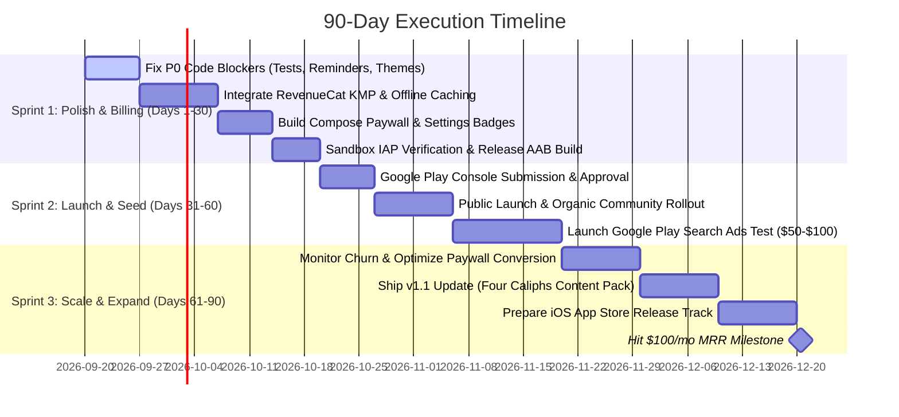

# 90-Day Launch & Monetization Master Plan: Reaching $100/Month

> **Target:** Achieve **$100+ USD / month** in recurring revenue within 90 days of public launch  
> **Platform Strategy:** Android (Google Play) first, followed by iOS  
> **Account Status:** Organization / Legacy Developer Account (Direct Production release, zero 20-tester blocker)  
> **Monetization Engine:** Ethical Freemium + Sadaqah Jariyah Patronage via RevenueCat KMP  

---

## 1. Feasibility & Unit Economics ($100/Month Target)

Making $100/month on mobile is a realistic and attainable milestone. Because the app charges non-predatory subscription and patron prices, the volume required is small:

```
┌────────────────────────────────────────────────────────────────────────┐
│                        PATHWAYS TO $100 / MONTH                        │
├────────────────────────────────┬───────────────────────────────────────┤
│ Model                          │ Required Volume                       │
├────────────────────────────────┼───────────────────────────────────────┤
│ Monthly Subscribers ($2.99/mo) │ ~35 active subscribers (~40 gross)    │
│ Annual Subscribers ($19.99/yr) │ ~5 new subscribers/mo (or 60 total)   │
│ Lifetime Patron ($39.99 once)  │ 3 purchases/mo                        │
│ Blended Mix                    │ 10 Monthly ($30) + 2 Lifetime ($80)   │
└────────────────────────────────┴───────────────────────────────────────┘
```

### Funnel Metrics (Conservative Benchmark)
* **Target Downloads (90 Days):** 1,200 – 1,500 total installs.
* **Paywall View Rate:** 50% of active users encounter the paywall (Settings or Day 3/7 milestones).
* **Conversion Rate:** 2.5% – 3.0% (standard for Islamic/mindfulness apps with free trials).
* **Paying Patrons:** 30 – 45 patrons → **$90 – $135 / month**.

---

## 2. Strategic Design Decisions (Locked In)

1. **Monetization Structure**: Ethical Freemium + Sadaqah Jariyah Patronage (Sahaba Plus).
   - Core 30-day journey is **100% free forever** (no paywalling spiritual reflection).
   - Patronage unlocks exclusive themes (Mushaf Parchment, Andalus Emerald, Midnight), Sadaqah patron badge, and priority access to future expansion packs.
2. **Launch Scope for Day 1**: Lightweight Patron Tier (Visuals & Support).
   - Keep existing 30 curated bilingual stories (EN/AR).
   - Defer full studio audio narrations to v1.1 to eliminate voice production delays and guarantee hitting the 90-day launch window.
3. **Paywall Placements**:
   - **Settings Screen**: Dignified "Become a Patron (Sahaba Plus)" banner.
   - **Theme Selector**: Tapping locked premium themes previews the theme and prompts the paywall.
   - **Milestone Cards**: Congratulatory celebration card after completing Day 3 and Day 7 journeys.
   - **First Launch**: Zero paywalls during onboarding to maximize initial engagement.
4. **Offline Entitlement Policy**:
   - Cached expiration timestamp in encrypted local storage.
   - Lifetime patrons are unlocked offline forever.
   - Monthly/Annual patrons have cached access up to their expiration date + 3 days grace before requiring a background reconnection.
5. **Acquisition & Distribution**:
   - Hybrid organic launch: Reddit (`r/islam`, `r/muslimtechnet`, `r/ProductiveMuslim`), TikTok/IG reels, and optimized App Store Search (ASO).
   - Small $50–$100 seed Google Play Search Ads test targeting US, UK, and GCC users.

---

## 3. 90-Day Sprint Schedule



---

## 4. Phase-by-Phase Task Breakdown

### Phase 1: Code Freeze & Critical Bug Resolution (Days 1–7)
- [ ] **Fix iOS Test Compilation Error**: Fix comma in test method names in [`JourneyRepositoryImplTest.kt`](file:///Users/macbookpro/Desktop/CompanionApp/shared/src/commonTest/kotlin/com/aslmmovic/qurancompanion/JourneyRepositoryImplTest.kt#L226) so `./gradlew :shared:allTests` passes cleanly.
- [ ] **Fix Notification Scheduler**: Remove the 15-minute test interval in [`AndroidNotificationScheduler.kt`](file:///Users/macbookpro/Desktop/CompanionApp/shared/src/androidMain/kotlin/com/aslmmovic/qurancompanion/util/AndroidNotificationScheduler.kt#L72-L75) and implement exact 24-hour periodic scheduling with initial delay.
- [ ] **Harmonize Dynamic Themes**: Update [`Theme.kt`](file:///Users/macbookpro/Desktop/CompanionApp/shared/src/commonMain/kotlin/com/aslmmovic/qurancompanion/ui/theme/Theme.kt) color schemes and mappings (`"golden"`, `"midnight"`, `"mushaf"`, `"sunrise"`).
- [ ] **Linear Progression**: Decouple Day 1 start from Gregorian calendar day-of-year modulo in [`JourneyRepositoryImpl.kt`](file:///Users/macbookpro/Desktop/CompanionApp/shared/src/commonMain/kotlin/com/aslmmovic/qurancompanion/data/repository/JourneyRepositoryImpl.kt#L85).
- [ ] **Release Security**: Gate [`DebugSettingsSection.kt`](file:///Users/macbookpro/Desktop/CompanionApp/shared/src/commonMain/kotlin/com/aslmmovic/qurancompanion/presentation/screens/settings/components/DebugSettingsSection.kt) behind a debug-only build check.

### Phase 2: RevenueCat KMP Integration & Paywall UI (Days 8–24)
- [ ] Add RevenueCat KMP dependency to `gradle/libs.versions.toml`.
- [ ] Add RevenueCat Proguard rules to `androidApp/proguard-rules.pro`.
- [ ] Create domain contracts: `BillingRepository`, `SubscriptionStatus`, `PurchaseSubscriptionUseCase`, `RestorePurchasesUseCase`.
- [ ] Implement data layer: `BillingRepositoryImpl` wrapping RevenueCat SDK + encrypted offline entitlement caching in `KeyValueStorage`.
- [ ] Design Compose Multiplatform `PaywallScreen` displaying:
  - 7-Day Free Trial value highlights.
  - Monthly ($2.99), Annual ($19.99), Lifetime ($39.99).
  - Sadaqah Jariyah patron messaging.
  - "Restore Purchases" and legal terms links.
- [ ] Integrate locked theme preview triggers and Day 3/Day 7 completion cards.

### Phase 3: Store Submission & Production Launch (Days 25–45)
- [ ] Create RevenueCat project and link Google Play service credentials.
- [ ] Set up Google Play Console in-app products and base plans (`monthly-patron`, `annual-patron`, `lifetime-patron`).
- [ ] Perform end-to-end sandbox purchase verification using Google Play License Testing accounts.
- [ ] Build signed production release bundle (`./gradlew :androidApp:bundleRelease`).
- [ ] Submit to Google Play Production track using existing metadata in [`docs/store/play_store_listing.md`](file:///Users/macbookpro/Desktop/CompanionApp/docs/store/play_store_listing.md).

### Phase 4: Growth, Optimization & Expansion (Days 46–90)
- [ ] Launch Reddit community posts (`r/islam`, `r/muslimtechnet`) and social reels.
- [ ] Deploy $50–$100 Google Play Search Ads campaign.
- [ ] Generate "Four Caliphs" expansion pack using `:journey_generation` tool for v1.1 update.
- [ ] Prepare iOS target for App Store submission.
- [ ] Reach and surpass $100/month MRR.
